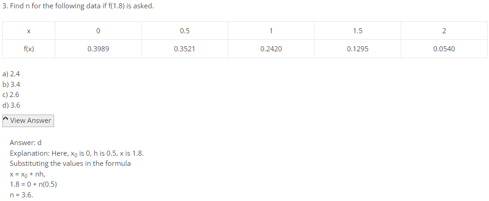
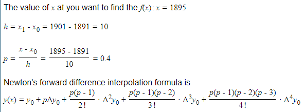
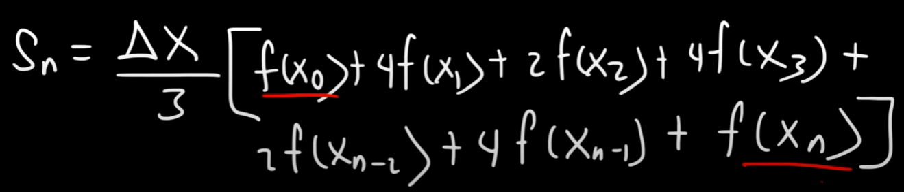
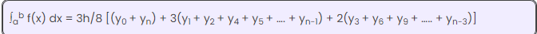
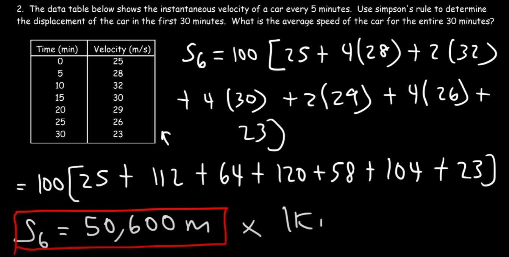
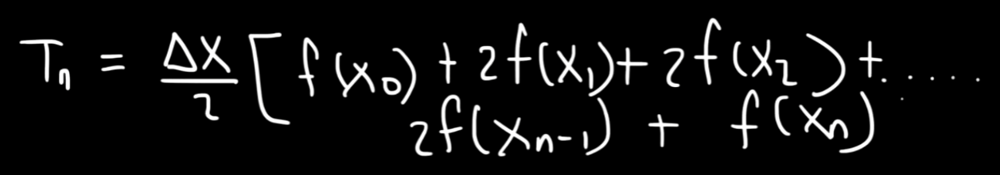
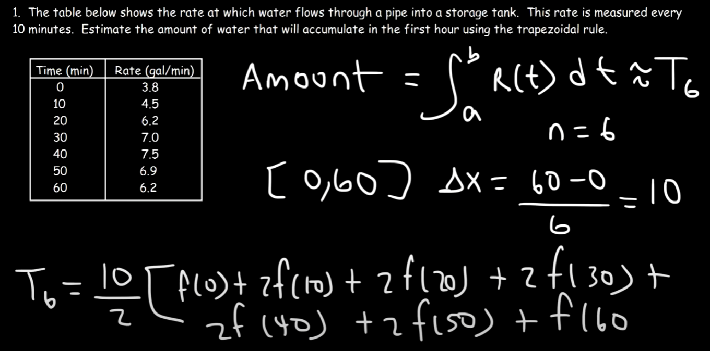
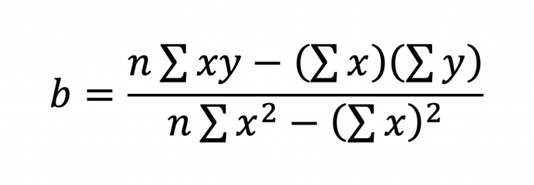

## Newton forward formula

# Interpolation
## Newton-Gregory Forward Interpolation Formula

## Newton Forward Difference Interpolation Formula

# Diff
## Simpson's rule formula
- 1/3 
- 3/8 
### Example

## Trapezoidal rule formula

### Example

## Linear Regression Using Least Squares Formula
